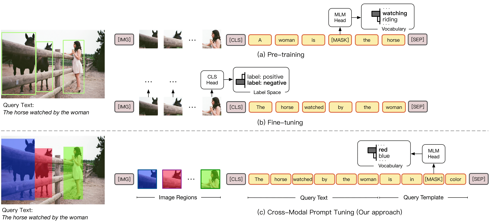

# CPT

This is the code for paper "[CPT: Colorful Prompt Tuning for Pre-trained Vision-Language Models](https://arxiv.org/abs/2109.11797)".

## Recent Updates
- [x] 2022.05.06 Initialize CPT for grounding, VRD, GQA, and VCR codes.


## Quick links

* [Overview](#overview)

* [Install](#install)

* [Preparation](#preparation)

* [Tasks](#tasks)
    * [1. Visual Grounding](#visual-grounding)
    * [2. GQA](#gqa)
    * [3. VCR (Visual Commonsense Reasoning)](#vcr)
    * [4. VG (Visual Genome)](#vg)
* [Bugs or questions?](#bugs-or-questions)

* [Acknowledgement](#acknowledgement)

## Overview


The code is based on two sub-repos. The prompt-feat is used to extract visual features with the help of pre-trained object detector. The Oscar is the pre-trained vision and language model to conduct inference.

## Install

We wrap all the commands in `install.sh`. You can directly run `bash install.sh`. Or:

```bash
# you can direcly run by 
# bash install.sh

# create a new environment
conda create --name cpt python=3.7
conda activate cpt

# install pytorch1.6
conda install pytorch==1.6.0 torchvision==0.7.0 cudatoolkit=10.2 -c pytorch

export INSTALL_DIR=$PWD

# install apex
cd $INSTALL_DIR
git clone https://github.com/NVIDIA/apex.git
cd apex
python setup.py install --cuda_ext --cpp_ext
cd ..

# install requirements
pip install -r requirements.txt

# install prompt_feat
cd prompt_feat
python setup.py build develop
cd ..

# install oscar
cd Oscar
# install transformers
git clone https://github.com/huggingface/transformers.git
cd transformers
git reset --hard 067923d3267325f525f4e46f357360c191ba562e
cd ..
# install coco_caption
git clone https://github.com/LuoweiZhou/coco-caption.git
cd coco-caption
git reset --hard de6f385503ac9a4305a1dcdc39c02312f9fa13fc
# ./get_stanford_models.sh
cd ..
python setup.py build develop

unset INSTALL_DIR
```

## Preparation
Before running the code, please first download the pre-trained feature extractor and Oscar models.

```sh
bash cmds/prepare_data/download_checkpoints.sh
```

After downloading, there should be:

```
Oscar/pretrained_models/image_captioning/pretrained_base/pytorch_model.bin
prompt_feat/models/vinvl/vinvl_vg_x152c4.pth
```


## Tasks
### 1. Visual Grounding

Visual Grounding task is to find the visual region corresponding to a query sentence *e.g.: the black horse*.

#### Data

**Note:** all the data will be downloaded at the `data` directory. If you want to download it at somewhere else, you can create a soft link:

```sh
ln -s your_data_path data
```


Please download the data first.

```sh
bash cmds/prepare_data/download_refcoco.sh
```

#### Feature Extraction

To extract features:

```sh
cd prompt_feat
bash cmds/refcoco/prepare.sh # make sure you have at least 4 GPUs
# actually 1 GPU is also OK, don't panic.
```

To modify the code to single GPU or other amount. Please go to `prompt_feat/cmds/refcoco/cpt`, and modify `CUDA_VISIBLE_DEVICES`, `--nproc_per_node` and `TEST.IMS_PER_BATCH` correspondingly.


#### CPT Inference

To inference:

```sh
cd Oscar
bash cmds/refcoco/cpt_run_all.sh
```

We use the `GPU:0` as default choice. If you want to modify the GPU id, please go to `cmds/refcoco/cpt_run_all.sh` and modify the `GPU=0` to the GPU id you want. 

#### Evaluation

To evaluate, please run:

```sh
cd Oscar
python eval/refcoco/fewshot_eval.py results/refcoco/fsl/
```


### 2. GQA

GQA is a QA dataset, required reasoning ability.

#### Data

Please download the data first.

```sh
bash cmds/prepare_data/download_gqa.sh
```


#### Feature Extraction

To extract features:

```sh
cd prompt_feat
bash cmds/gqa/prepare.sh # make sure you have at least 4 GPUs
# actually 1 GPU is also OK, don't panic.
```

To modify the code to single GPU or other amount. Please go to `prompt_feat/cmds/gqa/*.sh`, and modify `CUDA_VISIBLE_DEVICES`, `--nproc_per_node` and `TEST.IMS_PER_BATCH` correspondingly.


#### CPT Inference

To inference:

```sh
cd Oscar
bash cmds/gqa/cpt_fsl.sh
bash cmds/gqa/pt_fsl.sh
```

We use the `GPU:0,1,2,3` as default choice. If you want to modify the GPU ids, please go to `cmds/gqa/cpt_fsl.sh and pt_fsl.sh`. You can also modify the program to single GPU without modifing the batchsize. The result is supposed to be similar because I set the gradient accumulation step to be the dataset size. 


#### Evaluation

To evaluate, please run:

```sh
cd Oscar
bash eval/gqa/show.sh
```

### 3. VCR (Visual Commonsense Reasoning)

VCR is a multiple-choice QA dataset, including `question->answer`, `quesntion+answer->rationale` and `question->answer+rationale` tasks.

#### Data

Please download the data first.

```sh
bash cmds/prepare_data/download_vcr.sh
```


#### Feature Extraction

To extract features:

```sh
cd prompt_feat
bash cmds/vcr/prepare.sh # make sure you have at least 4 GPUs
# actually 1 GPU is also OK, don't panic.
```

To modify the code to single GPU or other amount. Please go to `prompt_feat/cmds/vcr/pt_vcr_val_seg and cpt_vcr_val_seg`, and modify `CUDA_VISIBLE_DEVICES`, `--nproc_per_node` and `TEST.IMS_PER_BATCH` correspondingly.


#### CPT Inference

To inference:

```sh
export GPUID=0

# vcr_q_a
bash cmds/vcr/cpt_fsl.sh $GPUID vcr_q_a cpt
bash cmds/vcr/pt_fsl.sh $GPUID vcr_q_a pt

# vcr_qa_r
bash cmds/vcr/cpt_fsl.sh $GPUID vcr_qa_r cpt
bash cmds/vcr/pt_fsl.sh $GPUID vcr_qa_r pt

# vcr_qar
bash cmds/vcr/qar_cpt_fsl.sh $GPUID vcr_qar cpt
bash cmds/vcr/qar_pt_fsl.sh $GPUID vcr_qar pt
```

We use the `GPU:0` as default choice. If you want to modify the GPU id, please modify the `GPUID=0` to the GPU id you want. 

Meanwhile, our implementation enables running all tasks simutaneously, by assigning different GPUIDs to different tasks.

#### Evaluation

To evaluate, please run:

```sh
cd Oscar
bash eval/vcr/show.sh
```


### 4. VG (Visual Genome)

VG is a visual relation detection dataset. The model should detect relational triplet in images.

#### Data

Please download the data first.

```sh
bash cmds/prepare_data/download_vg.sh
```


#### Feature Extraction

To extract features:

```sh
cd prompt_feat
bash cmds/vg/prepare.sh # make sure you have at least 4 GPUs
# actually 1 GPU is also OK, don't panic.
```

To modify the code to single GPU or other amount. Please go to `prompt_feat/cmds/vg/_vg_val.sh and _vg_test.sh`, and modify `CUDA_VISIBLE_DEVICES`, `--nproc_per_node` and `TEST.IMS_PER_BATCH` correspondingly.


#### CPT Inference

To inference:

```sh
cd Oscar
bash cmds/vg/cpt_run_all.sh
```

We use the `GPU:0,1,2,3` as default choice. If you want to modify the GPU id, please go to `Oscar/cmds/vg/_fsl.sh` to modify `CUDA_VISIBLE_DEVICES` and `--nproc_per_node`.  Note that the `--per_gpu_train_batch_size` multiply number of GPUs should be 40. Or the result will be different.


#### Evaluation

To evaluate, please run:

```sh
cd Oscar
bash eval/vg/eval_vg.py
```


## Bugs or questions?
If you have any questions related to the code or the paper, feel free to email Ao Zhang (`zhanga6@outlook.com`). If you encounter any problems when using the code, or want to report a bug, you can open an issue. Please try to specify the problem with details so we can help you better and quicker!


## Acknowledgement
The code is built on [scene_graph_benchmark](https://github.com/microsoft/scene_graph_benchmark) and [Oscar](https://github.com/microsoft/Oscar)
Thanks for their excellent codes.
